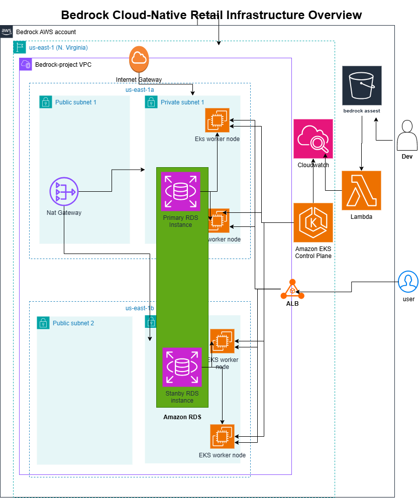

# Project Bedrock

This is a repository that contains a production-ready infrastructure for a cloud-native AWS Retail Store Sample application, databases, message brokers, and CI/CD pipeline for automation.

## Architecture


## Project Structure

```text
project-bedrock/
├── .github/
│   └── workflows/
│       └── infra-deploy.yml
├── helm/
|   ├── dynamodb/
|   ├── ms-values/
|   ├── rabbitmq/
|   ├── redis/
|   ├── deploy.sh
|   └── ingress.yaml
├── terraform/
|   ├── bedrock_asset_processor.py
|   ├── bedrock_asset_processor.zip
│   ├── main.tf
│   ├── variables.tf
│   ├── outputs.tf
│   ├── terraform.tfvars.example
│   └── modules/
│       ├── eks/
│       ├── iam/
│       ├── ingress/
│       ├── monitoring/
│       ├── networking/
|       ├── rds/
|       ├── secret-manager/
|       └── storage
├── terraform-remote-backend/
│   ├── remote-backend.tf
│   └── variables.tf
├── .gitignore
├── grading.json
├── Project-bedrock-architecture-diagram.png
└── README.md
```
## Prerequisites

Before deploying, ensure you have the following installed and configured:

### 1. Terraform

Download from:
[https://developer.hashicorp.com/terraform/downloads](https://developer.hashicorp.com/terraform/downloads)

Verify installation:

```bash
terraform -v
```

---

### 2. AWS CLI

Install the AWS CLI:
[https://docs.aws.amazon.com/cli/latest/userguide/getting-started-install.html](https://docs.aws.amazon.com/cli/latest/userguide/getting-started-install.html)

Verify installation:

```bash
aws --version
```

Configure AWS credentials:

```bash
aws configure
```

You will be prompted for:

* AWS Access Key ID
* AWS Secret Access Key
* Default region (e.g. eu-west-2)
* Output format (optional)

---
### 3. GitHub Secrets & Variables

The GitHub Actions workflow requires the following:

**Secrets**:

* `AWS_ACCESS_KEY_ID`
* `AWS_SECRET_ACCESS_KEY`
* `S3_BUCKET` (S3 bucket for Terraform remote state)
* `DB_PASSWORD`
* `DB_USERNAME`
* `RABBITMQ_USERNAME`
* `RABBITMQ_PASSWORD`

**Variables**:

* `AWS_REGION`
* `CIDR_BLOCK`
* `ELS_CLUSTER_NAME`
* `INSTANCE_TYPE`
* `PROJECT_NAME`

---

## Deployment Guide

### Automated Deployment with GitHub Actions (Best and Recommended)

Infrastructure deployment is automated using **GitHub Actions**.

This ensures:

* Safe, repeatable infrastructure changes
* No manual Terraform execution required
* No manual helm charts deployment required

### Deployment Trigger

* Any `push` to the `main` branch affecting files under `terraform/` trigger Terraform apply job, and Deploy helm charts job runs if terraform apply job is successful.

### What the workflow does

* Checks out the repository
* Sets up Terraform
* Formats and validates Terraform code
* Configure AWS credentials
* Initializes Terraform with an S3 backend
* Run Terrafrom apply
* If terraform apply is successful, deploy helm charts

### Destroy Trigger

* Manually triggered using `workflow_dispatch`

## Accessing the Application

After deployment, the workflow logs outputs include **Frontend UI service Load Balancer URL** to access the application.

---

## Author

**Paul Adegoke**

AltSchool Africa – Cloud Engineering Track
Capstone Project: "Project Bedrock" - Production-Grade Microservices on AWS EKS

---